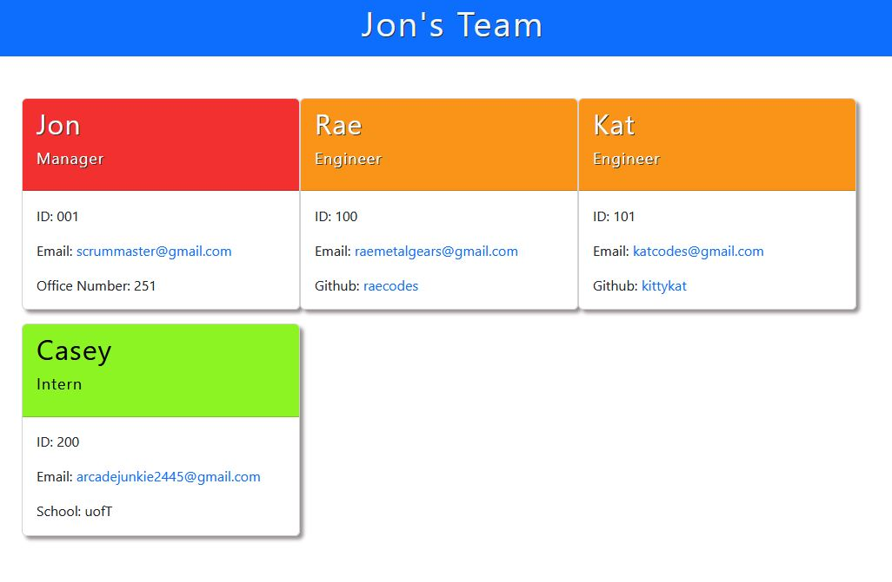

# Team Profile Generator (Built with Node)


## Description

A profile card generator using [NodeJS](https://nodejs.org/en/) and the npm package [Inquirer](https://www.npmjs.com/package/inquirer). After answering a series of prompts for questions relating to name and email address, an HTML file is created showing your team's information (names, emails, github account, school and office number).



### My motivations

Wanting to store my team's information on a webpage that displays my team's basic info so that I can have quick access to their emails and GitHub profiles.

### What I learned

I was able to get more practise in using nodeJS, the inquirer package and in using the command line to write and run JavaScript code.

First time using [Jest](https://jestjs.io/) which had a bit of a learning curve to. Something that will require more practise with in the future.

## Preview

[video to youtube link](https://www.youtube.com/watch?v=s1CMUl7fN28)

## Table of Contents

- [Installation](#installation)
- [Usage](#usage)
- [Credits](#credits)
- [License](#license)
- [Questions](#questions)

## Installation

1. Download the code to your own local machine and open up in a terminal of your choice (like VS code).

2. Open terminal, and run

```
npm install
```

3. Once all the missing node packages are installed, run a quick test

```
npm test
```

```
NOTE: If nodeJS is not installed on your machine, download at nodejs.org
```

## Usage

Once project is downloaded and the node_modules folder is downloaded, you are ready to begin.

Run the command

```
node index.js
```

Then simply answer all the questions in your terminal, until the HTML file is created

## Credits

- [InquirerJS](https://www.npmjs.com/package/inquirer)
- [JestJS](https://jestjs.io/)

## License

[](https://choosealicense.com/licenses/mit/)

For more information about the licensing of this project, please click on the badge above, or follow this link https://choosealicense.com/licenses/mit/

## How to Contribute

Fork, submit pull requests and star the project!

## Questions

How to get into contact with me?

[My Github Profile](https://github.com/Jon-Ledo)

Email : jonledo.code@gmail.com
